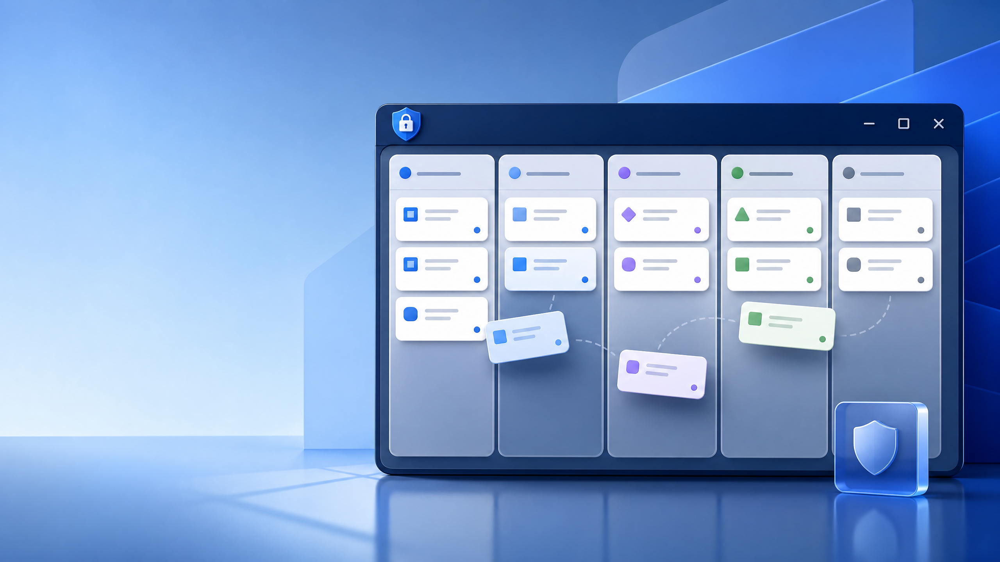
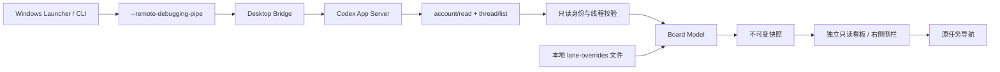
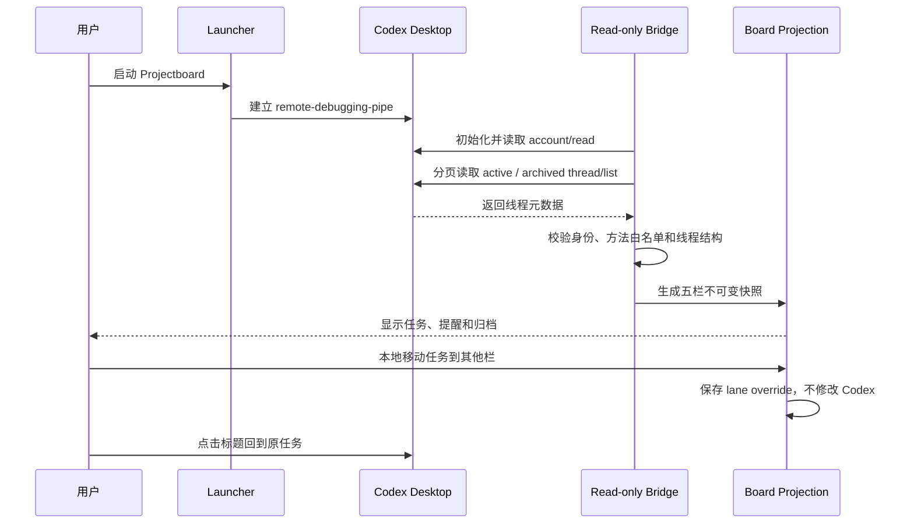

# Codex Projectboard



> 面向 Windows 版 Codex Desktop 的本地五栏任务投影板。它读取活动与归档线程，在右侧工作区提供更清晰的整理视图；**不会修改 Codex 的真实任务状态**。

## 为什么需要它

Codex Desktop 的任务目录包含活动线程、归档线程和等待用户处理的状态。Projectboard 将这些线程投影为一个本地五栏视图，帮助用户知道哪些任务正在运行、哪些需要输入、哪些可以整理，而不把本地整理动作误认为已经改变了 Codex 的源任务。

当前版本是 Phase 1 安全预览，核心目标是“读取、解释、导航和本地整理”，不是自动化执行或注入 Codex。

## 功能范围

| 功能 | 说明 |
|---|---|
| 五栏投影 | 收集箱、已规划、执行中、待验收、完成。 |
| 活动与归档读取 | 对 `thread/list` 分页读取，合并活动和归档目录并去重。 |
| 状态提示 | 将等待审批、等待用户输入和系统错误映射为明确的人工下一步。 |
| 原任务导航 | 点击任务标题回到原 Codex 任务。 |
| 本地栏位覆盖 | 使用卡片操作移动栏目，状态保存到本机，不写回 Codex。 |
| 自动刷新 | 默认每 30 秒刷新；刷新失败时保留最后一次已确认快照。 |
| 侧栏模式 | 保留 Codex 原生左侧导航，在右侧打开独立的 Projectboard 视图。 |

当前不支持拖放；请使用卡片上的“移动到其他栏”操作。

## 系统架构



Projectboard 的数据方向是单向的：**Codex 源目录 → 只读桥接 → 校验 → 本地投影 → UI**。栏位覆盖只进入本地模型，不进入 App Server。

## 功能流程



## 只读安全边界

| 允许 | 明确禁止 |
|---|---|
| `initialize`、`initialized`、`account/read`、分页 `thread/list` | 启动、恢复、引导或中断任务 |
| 读取活动和归档线程元数据 | 创建任务、创建模型回合或发送消息 |
| 本机保存 Projectboard 栏位覆盖 | 归档、删除、批准或改变 Codex 状态 |
| 通过受验证的导航回到原任务 | 开放调试 TCP 端口或执行未授权注入 |

侧栏文档离线、无脚本、无远程资源，CSP 禁止脚本和网络连接。Phase 0 报告和运行产物含有环境绑定信息，因此不会提交到仓库。

## 环境要求

- Windows 10/11
- 已安装并登录 Codex Desktop
- Node.js `>=22.12.0`
- Windows PowerShell 5.1 或 PowerShell 7
- 按 [Phase 0 runbook](docs/phase-0-runbook.md) 在本机生成且匹配当前 Codex 包版本的报告

不要复制其他机器的 Phase 0 报告；其中可能包含本机路径、包版本和身份摘要。

## 启动方式

完全退出 Codex Desktop 后，在仓库根目录双击：

```text
Start-Codex-Projectboard.cmd
```

或使用 PowerShell：

```powershell
powershell.exe -NoLogo -NoProfile -ExecutionPolicy Bypass -File scripts\start-projectboard-sidebar.ps1
```

也可以运行独立的本地只读看板：

```powershell
npm.cmd install
npm.cmd run board
```

控制器终端需要保持运行。由控制器启动的 Codex 关闭后，控制器会自动退出。启动日志写入 `artifacts\phase-1\sidebar-startup-latest.log`；`artifacts/` 已被 Git 忽略。

## 本地状态配置

栏位覆盖保存于：

```text
%LOCALAPPDATA%\CodexProjectboard\lane-overrides.v1.json
```

该文件只保存 Projectboard 自己的 `threadId -> laneId` 映射，不保存任务正文，也不修改 Codex 的源数据。删除它可以清空本地整理结果，但不会删除 Codex 任务。

## 测试与质量检查

```powershell
npm.cmd test
npm.cmd run test:unit
npm.cmd run test:integration
```

测试覆盖 CLI 参数、只读方法白名单、身份锁、线程分页、看板模型、栏位覆盖、侧栏控制器、Windows 启动器、网络路径和安全策略。依赖 Windows、PowerShell、Codex Desktop 或 live probe 的测试在不满足环境条件时可能跳过；这类跳过应与纯单元测试结果分开解读。

## 项目结构

```text
src/phase-1/                 Phase 1 只读桥接、服务和看板实现
src/                           CLI、探测、启动和通用运行时
tests/unit/                    无外部服务的单元测试
tests/integration/             本地 API、只读服务和报告集成测试
docs/                          Phase 0/1 边界与运行手册
fixtures/                     测试身份、线程和报告 fixture
scripts/                      Windows 启动和诊断脚本
design.md                     视觉、交互和可访问性约定
```

## 当前状态与后续边界

当前版本完成了五栏读取、原任务导航和本地栏位编排。拖放执行、模型回合、任务写入和其他注入式能力均为 No-Go，除非未来获得官方宿主扩展合同并通过新的安全评审。

## 许可证

项目代码和文档按仓库中的许可证与第三方依赖条款使用。使用 Codex Desktop、OpenAI/Codex 包和其他宿主组件时，还需要遵守对应服务的条款。
